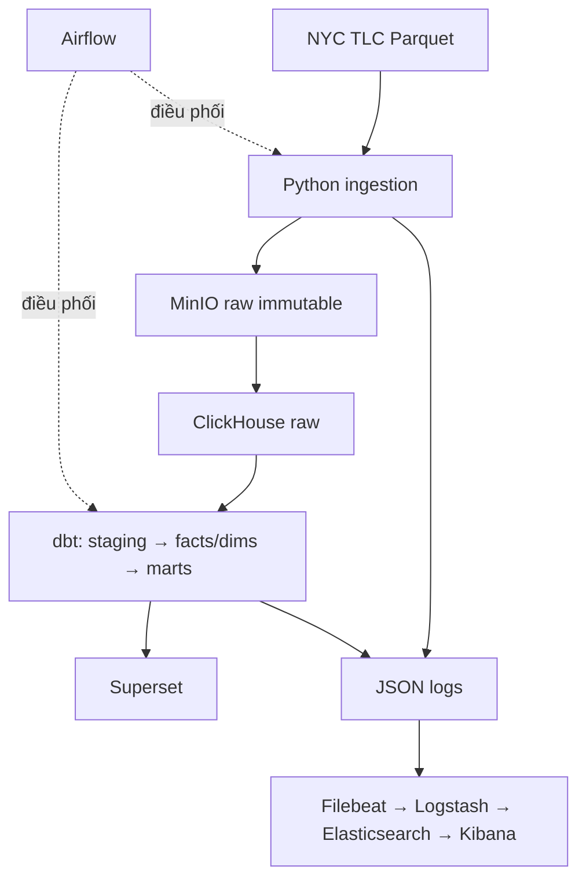

Phương án tối ưu cho máy 16 GB là **batch ELT với native ClickHouse làm warehouse chính**:



TLC phát hành Parquet theo tháng, thường trễ khoảng hai tháng, cảnh báo schema có thể thay đổi và không đảm bảo dữ liệu hoàn toàn chính xác. Từ năm 2025 còn thêm `cbd_congestion_fee`. Vì vậy pipeline phải ưu tiên schema drift, reconciliation, idempotency và replay. [NYC TLC Trip Record Data](https://www.nyc.gov/site/tlc/about/tlc-trip-record-data.page).

## 1. Đánh giá và tối ưu tech stack

| Thành phần                   | Quyết định                   | Cách sử dụng                                                                                                                                                                                                    |
| ---------------------------- | ---------------------------- | --------------------------------------------------------------------------------------------------------------------------------------------------------------------------------------------------------------- |
| Docker Compose               | Giữ                          | Tách profile `core`, `bi`, `observability`, `iceberg-lab`; pin version image, healthcheck, named volume                                                                                                         |
| MinIO                        | Giữ                          | Raw source of truth; bật versioning, giữ nguyên Parquet để replay                                                                                                                                               |
| Python + PyArrow             | Thêm                         | Download streaming, checksum, đọc metadata/schema Parquet; không dùng để transform nghiệp vụ                                                                                                                    |
| Airflow + PostgreSQL         | Giữ                          | `LocalExecutor`, orchestration và backfill; PostgreSQL có database riêng cho metadata và ingestion manifest                                                                                                     |
| ClickHouse                   | Giữ                          | Native `MergeTree`; đọc MinIO trực tiếp bằng `s3()` rồi load vào raw tables. [ClickHouse S3 integration](https://clickhouse.com/docs/integrations/connectors/data-ingestion/AWS/integrating-s3-with-clickhouse) |
| dbt-clickhouse               | Giữ                          | Staging, facts, dimensions, SCD, marts, tests; adapter hỗ trợ incremental, snapshots và data tests. [dbt–ClickHouse](https://clickhouse.com/docs/integrations/connectors/data-ingestion/etl-tools/dbt)          |
| Superset                     | Giữ                          | Chỉ query aggregate marts, không query trực tiếp raw tables                                                                                                                                                     |
| ELK + Filebeat               | Giữ nhưng tách profile       | Filebeat thu JSON logs; Logstash enrich/route; Elasticsearch lưu log; Kibana điều tra lỗi                                                                                                                       |
| Iceberg                      | Không đặt trên critical path | Chỉ làm optional export/lab sau MVP; khả năng ghi hiện vẫn cần tính năng thử nghiệm. [ClickHouse Iceberg write](https://clickhouse.com/docs/guides/use-cases/data-warehousing/getting-started/writing-data)     |
| Kafka, Spark, Flink, Airbyte | Không thêm                   | Source là monthly batch Parquet; streaming/distributed compute không giải quyết vấn đề thực tế                                                                                                                  |
| Great Expectations/Soda      | Chưa thêm                    | PyArrow validation + dbt tests đã đủ cho MVP; tránh trùng vai trò                                                                                                                                               |

## 2. Data modeling

Nên dùng **fact constellation với conformed dimensions**, không union tất cả vào một fact rộng chứa nhiều `NULL`. Yellow/Green có meter và fare; FHV khá ít thuộc tính; HVFHV có request time, wait time, driver pay, shared ride và WAV. [Yellow dictionary](https://www.nyc.gov/assets/tlc/downloads/pdf/data_dictionary_trip_records_yellow.pdf), [HVFHV dictionary](https://www.nyc.gov/assets/tlc/downloads/pdf/data_dictionary_trip_records_hvfhs.pdf).

### Fact tables

| Bảng                       | Grain                       | Measures chính                                                                        |
| -------------------------- | --------------------------- | ------------------------------------------------------------------------------------- |
| `fct_taxi_trip`            | Một Yellow/Green trip       | duration, distance, passenger count, fare, tip, toll, taxes, surcharges, total amount |
| `fct_hvfhv_trip`           | Một HVFHV trip              | wait time, duration, miles, base fare, driver pay, tips, shared/WAV flags             |
| `fct_fhv_trip`             | Một regular FHV trip        | duration, pickup/drop-off zones, dispatching/affiliated base                          |
| `agg_mobility_zone_hourly` | Service × zone × hour       | pickups, drop-offs, net flow, p50/p95 duration                                        |
| `agg_route_daily`          | Date × service × PU/DO zone | trips, distance, p50/p95 travel time                                                  |
| `agg_revenue_daily`        | Date × service/provider     | fare, tips, driver pay, surcharges                                                    |
| `agg_dq_daily`             | Run × dataset × test        | rows, invalid rate, null rate, failed tests                                           |

### Dimensions và SCD

| Dimension                           | Chiến lược                                                                                        |
| ----------------------------------- | ------------------------------------------------------------------------------------------------- |
| `dim_date`                          | Type 0; ngày, tuần, tháng, holiday, weekday                                                       |
| `dim_service_type`                  | Type 0: Yellow, Green, FHV, HVFHV                                                                 |
| `dim_payment_type`, `dim_rate_code` | Type 1; sửa mô tả hiện tại, chỉ chuyển Type 2 khi có effective date đáng tin cậy                  |
| `dim_taxi_zone`                     | **SCD Type 2** theo `LocationID`; theo dõi borough, zone, service zone, centroid và geometry hash |
| `dim_base_provider`                 | **SCD Type 2** theo base license; theo dõi entity name, base type, address, trạng thái            |
| `dim_vendor`                        | **SCD Type 2** theo `(service_type, vendor_id)` khi mapping vendor thay đổi                       |

Nguồn bổ sung phù hợp cho SCD là [NYC Taxi Zones](https://data.cityofnewyork.us/Transportation/NYC-Taxi-Zones/8meu-9t5y) và [Current Bases](https://data.cityofnewyork.us/Transportation/CURRENT-BASES/eccv-9dzr).

Cách triển khai SCD2:

1. Chụp snapshot reference data mỗi tháng vào MinIO.
2. Tạo `attribute_hash` từ các thuộc tính cần theo dõi.
3. Chạy `dbt snapshot` với `check` strategy.
4. Dimension có `surrogate_key`, `natural_key`, `valid_from`, `valid_to`, `is_current`.
5. Khi build fact, resolve surrogate key theo thời điểm chuyến đi.
6. Dùng key `0 = Unknown` cho late-arriving dimension rồi rebuild partition liên quan.
7. Test: không overlap hiệu lực, một current row/natural key, `valid_from < valid_to`.

Lưu ý: nếu nguồn chỉ cung cấp trạng thái hiện tại, `valid_from` là thời điểm pipeline quan sát thay đổi, không được tuyên bố là effective date lịch sử chính xác.

### ClickHouse physical design

* Partition raw/fact theo `source_yyyymm` để dễ replay và thay thế file bị sửa.
* `ORDER BY (pickup_date, service_type, pickup_zone_id, pickup_datetime)`.
* Tiền dùng `Decimal`, timestamp dùng `DateTime64`, code dùng `LowCardinality(String)`.
* Không ép unique bằng `trip_hash`: TLC không có trip ID tự nhiên. Idempotency phải dựa trên checksum file và partition.
* Chỉ thêm projection/materialized view sau khi benchmark chứng minh cần thiết.

## 3. Kế hoạch triển khai

| Giai đoạn            | Action items                                                                                                                                                                                              | Tiêu chí hoàn thành                                                   |
| -------------------- | --------------------------------------------------------------------------------------------------------------------------------------------------------------------------------------------------------- | --------------------------------------------------------------------- |
| 0. Repository        | Tạo `infra/`, `images/`, `src/ingestion/`, `dags/`, `dbt/`, `superset/`, `observability/`, `tests/`; thêm `.env.example`, Makefile và version matrix                                                      | Fresh clone không cần sửa code hoặc đường dẫn máy                     |
| 1. Docker            | Tạo custom image cho `ingestion`, `airflow`, `dbt`; dùng pinned official image cho MinIO, PostgreSQL, ClickHouse, Superset và Elastic; thêm healthcheck, resource limit, named volume                     | `docker compose --profile core up --wait` báo toàn bộ healthy         |
| 2. MinIO ingestion   | Bucket layout: `raw/trip_type=.../year=.../month=...`; download multipart; lưu SHA-256, ETag, byte size, row count, schema hash; bật object versioning                                                    | Chạy lại cùng checksum phải skip; file thay đổi tạo version mới       |
| 3. Schema validation | Dùng PyArrow đọc Parquet footer; kiểm tra required columns, compatible types, row count > 0; quản lý contract YAML theo trip type/schema version                                                          | File sai schema bị dừng trước ClickHouse và ghi rõ diff               |
| 4. ClickHouse raw    | Tạo bốn raw tables; explicit casts, không dựa hoàn toàn vào schema inference; load vào staging table rồi `REPLACE PARTITION`; lưu `_source_file`, `_checksum`, `_loaded_at`, `_run_id`                    | Row count ClickHouse bằng Parquet metadata; rerun không tạo duplicate |
| 5. Airflow           | Một DAG gồm TaskGroups `discover → ingest → validate → load → dbt → dq → publish`; dynamic mapping theo trip type; XCom chỉ chứa path/metadata; `max_active_runs=1`, `parallelism=2`, retries exponential | Manual backfill và scheduled run dùng cùng DAG, kết quả idempotent    |
| 6. dbt               | Tạo `sources → staging → intermediate → dimensions/facts → marts`; staging chuẩn hóa column names; snapshots cho SCD2; incremental theo `source_yyyymm`; macro rebuild monthly partition                  | `dbt build` xanh; load tháng mới không scan lại toàn bộ lịch sử       |
| 7. Data quality      | File-level gate, reconciliation, relationship tests, SCD tests, amount reconciliation và anomaly monitoring; lưu failed rows vào `dq_audit`                                                               | Fixture cố tình hỏng phải làm pipeline fail đúng task                 |
| 8. Superset          | Kết nối ClickHouse; chỉ expose marts; tạo datasets/metrics có mô tả; export dashboard YAML vào Git                                                                                                        | Dashboard tải dưới khoảng 3 giây trên aggregate marts                 |
| 9. ELK               | Các job ghi JSON chứa `run_id`, `dag_id`, `task_id`, `trip_type`, `source_month`, rows, bytes, duration, status, error; Filebeat → Logstash → ES → Kibana; retention 7–14 ngày                            | Từ một `run_id` truy vết được toàn bộ ingestion, dbt và DQ            |
| 10. CI/CD            | `ruff`, `pytest`, dbt parse/build trên sample Parquet, Docker build, compose smoke test; benchmark full month; viết runbook/backfill guide                                                                | Fresh clone → một lệnh chạy E2E sample; CI không cần full dataset     |
| 11. Kubernetes-ready | Config qua env/Secret, state qua volume, container chạy non-root, graceful shutdown; sau này đổi DockerOperator thành KubernetesPodOperator                                                               | Không có dependency vào local path hoặc state bên trong container     |

Airflow khuyến nghị truyền dữ liệu lớn qua object storage, còn XCom chỉ dùng cho thông tin nhỏ như object path. [Airflow best practices](https://airflow.apache.org/docs/apache-airflow/stable/best-practices.html).

## 4. Data-quality gates quan trọng

* **Fail pipeline:** Parquet không đọc được, thiếu required column, type không tương thích, checksum/row count lệch, load trùng file, SCD validity overlap.
* **Quarantine row:** drop-off trước pickup, duration âm, location không tồn tại, flag ngoài domain.
* **Warning:** volume/null rate lệch lớn so với trailing median, tốc độ bất thường, fare âm.
* Kiểm tra tổng tiền với tolerance, nhưng không hard-fail trước khi profile vì có adjustment/refund.
* `shared_match_flag = Y` phải được theo dõi cùng `shared_request_flag`.
* Không hard-test uniqueness của trip fingerprint vì hai chuyến thật có thể trùng toàn bộ business attributes.

## 5. Dashboard và metrics có ý nghĩa

| Dashboard             | Metrics                                                                              |
| --------------------- | ------------------------------------------------------------------------------------ |
| Mobility overview     | Trips/ngày, MoM growth, service share, peak/off-peak ratio                           |
| Zone demand           | Pickup/drop-off, net flow, top OD routes, p50/p95 duration                           |
| Taxi economics        | Fare/trip, fare/mile, tip rate cho card trips, surcharge composition, CBD fee        |
| HVFHV service quality | Request-to-pickup p50/p90/p95, shared-match rate, WAV fulfillment rate               |
| Airport & CBD         | Trips sân bay, airport fee, CBD trips và fee; dùng 2024–2025 nếu phân tích trước/sau |
| Pipeline quality      | Rows/file, schema version, null/invalid rate, failed tests, processing throughput    |

Không cộng revenue của regular FHV vì dataset không có fare; không diễn giải `tip_amount` taxi là tổng tip vì cash tips không được ghi nhận.

## 6. Scope và tài nguyên 16 GB

* **MVP:** tháng 01/2025, đủ Yellow, Green, FHV và HVFHV.
* **Portfolio release:** toàn bộ năm 2025, xử lý tuần tự từng tháng.
* **Phân tích CBD:** thêm năm 2024 để có baseline trước khi phí bắt đầu.
* Docker Desktop giới hạn khoảng 11–12 GB.
* ClickHouse khoảng 4 GB, `max_threads=2–4`.
* Airflow `LocalExecutor`, `parallelism=2`, `max_active_runs=1`.
* ELK chạy bằng profile riêng; tắt Superset/ELK khi full load. Log nằm trên persistent volume để Filebeat đọc bù sau. Docker hỗ trợ resource limits và healthcheck để kiểm soát môi trường này. [Docker resource constraints](https://docs.docker.com/engine/containers/resource_constraints/), [Filebeat container logs](https://www.elastic.co/docs/reference/beats/filebeat/filebeat-input-container).

Điểm gây impact với nhà tuyển dụng sẽ là: **schema evolution, atomic partition replacement, idempotent backfill, SCD2 thực tế, data-quality gates, trace theo `run_id`, benchmark trước/sau tối ưu và khả năng chuyển cùng Docker images lên Kubernetes**—không phải số lượng tool.


# Backfill
Hoàn toàn mở rộng được và **không cần đổi kiến trúc**. Ngay từ đầu chỉ cần tránh hard-code năm 2025, thiết kế pipeline theo `trip_type + year + month`.

Hiện tại ngày 29/07/2026, TLC đã công bố:

* Tháng 01–04/2026: đủ Yellow, Green, FHV và HVFHV.
* Tháng 05/2026: đã có Yellow, Green và HVFHV; chưa thấy regular FHV.
* Dữ liệu thường được công bố trễ khoảng hai tháng. [NYC TLC Trip Record Data](https://www.nyc.gov/site/tlc/about/tlc-trip-record-data.page)

## Phạm vi dữ liệu theo lịch sử

| Dataset | Thời gian có dữ liệu | Lưu ý                                           |
| ------- | -------------------: | ----------------------------------------------- |
| Yellow  |       01/2009 trở đi | Schema thay đổi giữa các giai đoạn              |
| Green   |       08/2013 trở đi | Không tồn tại trước 08/2013                     |
| FHV     |          2015 trở đi | Trước giữa 2017 chủ yếu chỉ có thông tin pickup |
| HVFHV   |       02/2019 trở đi | Có wait time, driver pay, shared ride, WAV      |
| CBD fee |          2025 trở đi | Chỉ có ở Yellow, Green và HVFHV                 |

Lịch sử thay đổi field của FHV được TLC mô tả trong [TLC Trip Records User Guide](https://www.nyc.gov/assets/tlc/downloads/pdf/trip_record_user_guide.pdf).

## Những thứ cần thiết kế ngay từ đầu

### 1. Hai chế độ Airflow dùng chung code

* `nyc_taxi_monthly`: tự tìm và nạp tháng mới của năm 2026 trở đi.
* `nyc_taxi_backfill`: nhận `start_month`, `end_month`, `trip_types` để nạp quá khứ.

Ví dụ:

```json
{
  "start_month": "2019-02",
  "end_month": "2024-12",
  "trip_types": ["yellow", "green", "fhv", "hvfhv"],
  "force_reload": false
}
```

Với máy 16 GB, chỉ xử lý **một file hoặc một tháng tại một thời điểm**.

### 2. MinIO partition theo thời gian

```text
raw/
  trip_type=yellow/
    year=2026/
      month=01/
        yellow_tripdata_2026-01.parquet
```

Như vậy thêm năm 2027 hay backfill 2019 không cần sửa cấu trúc.

### 3. Manifest kiểm soát từng dataset/tháng

Khóa logic:

```text
trip_type + source_year_month + checksum
```

Manifest lưu:

* URL và trạng thái `AVAILABLE`, `NOT_PUBLISHED`, `NOT_APPLICABLE`.
* Checksum, kích thước, row count và schema hash.
* Thời gian load, `run_id`, trạng thái dbt/DQ.
* Phiên bản file hiện hành.

Nếu TLC sửa lại file quá khứ, checksum thay đổi và pipeline tự rebuild đúng partition.

### 4. Schema versioning

Không tạo một schema cứng cho mọi năm. Mỗi schema hash được ánh xạ về canonical columns:

* Cột chưa tồn tại trong năm cũ → `NULL`.
* Cột đổi tên → map về tên chuẩn.
* Cột mới tương thích → thêm nullable.
* Thay đổi kiểu dữ liệu hoặc thiếu cột bắt buộc → quarantine và cảnh báo.

Ví dụ `cbd_congestion_fee` trước năm 2025 phải để `NULL`, không nên ép thành `0`, vì `NULL` có nghĩa là “chưa áp dụng”.

### 5. Backfill bằng partition replacement

ClickHouse nên partition theo:

```sql
PARTITION BY (service_type, source_yyyymm)
```

dbt phải rebuild đúng tháng được truyền vào. Không dùng điều kiện kiểu:

```sql
pickup_datetime > max(pickup_datetime)
```

vì cách đó sẽ bỏ qua dữ liệu backfill cũ hơn tháng mới nhất.

### 6. Kiểm soát độ đầy đủ dashboard

Tạo mart `mart_data_coverage` chứa:

* Dataset nào tồn tại trong từng tháng.
* Field/metric nào có thể tính.
* Tháng nào đang `PROVISIONAL` hoặc `COMPLETE`.

Nhờ đó Superset không so sánh sai, chẳng hạn:

* Không tính OD route cho FHV khi chưa có drop-off.
* Không phân tích HVFHV trước 02/2019.
* Không so sánh CBD fee trước 2025.

## Lộ trình mở rộng hợp lý

1. **2025 + các tháng đã có của 2026:** hoàn thiện pipeline và monthly incremental.
2. **2024:** phân tích trước/sau congestion pricing.
3. **2019–2023:** backfill cả bốn nhóm dữ liệu theo phạm vi tồn tại.
4. **2015–2018:** Yellow, Green, FHV với schema adapters.
5. **2009–2014:** Yellow và Green theo phạm vi tồn tại.

Trên máy 16 GB, RAM không phải vấn đề chính vì load tuần tự; **dung lượng SSD và thời gian xử lý** mới là giới hạn. Nên giữ chi tiết 2024–2026 trong ClickHouse, còn dữ liệu cũ có thể giữ raw trên MinIO và materialize các aggregate daily/monthly. Khi cần phân tích sâu một giai đoạn, pipeline có thể replay lại partition từ MinIO.
