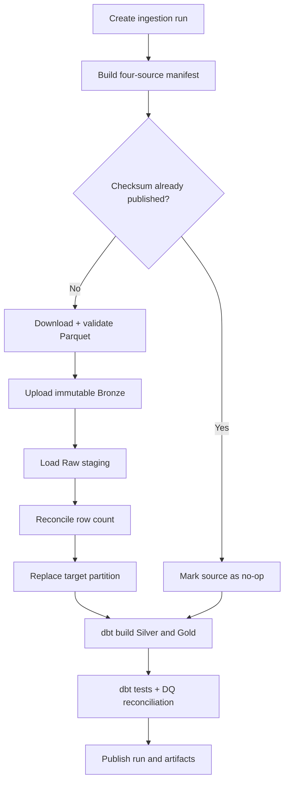

```mermaid
flowchart TB
    A["Create ingestion run"] --> B["Build four-source manifest"]
    B --> C{"Checksum already published?"}
    C -- "Yes" --> D["Mark source as no-op"]
    C -- "No" --> E["Download + validate Parquet"]
    E --> F["Upload immutable Bronze"]
    F --> G["Load Raw staging"]
    G --> H["Reconcile row count"]
    H --> I["Replace target partition"]
    I --> J["dbt build Silver and Gold"]
    D --> J
    J --> K["dbt tests + DQ reconciliation"]
    K --> L["Publish run and artifacts"]


```